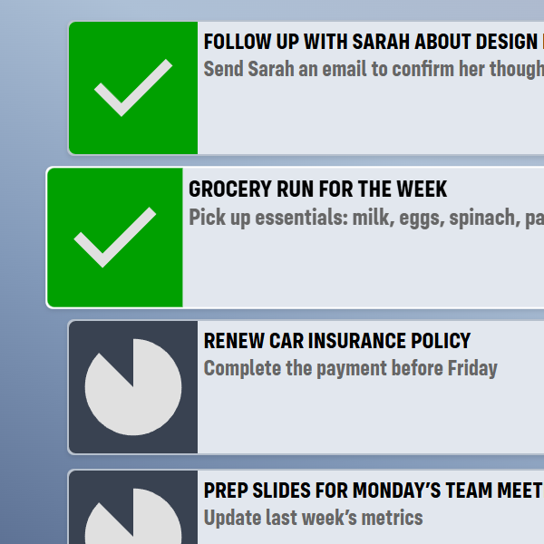
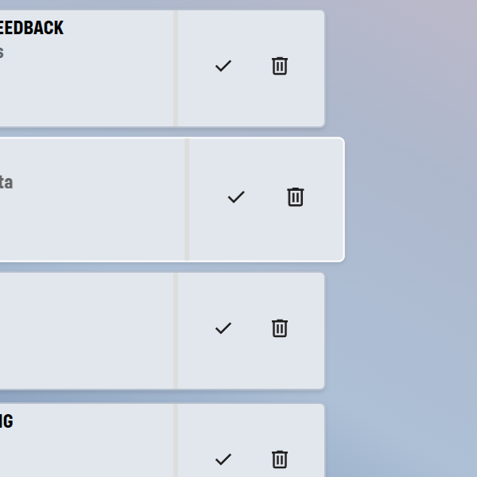

# ToDo App

View it live: 
[Todo App](https://todoapp-f9zz.onrender.com/) (Wait for the service to wake up) 

A simple, sleek, and responsive To-Do application to manage tasks efficiently.

## Description
This app allows users to create, and delete to-do items. Helping users stay organized.

## Features
- Add, delete tasks
- Add description for tasks
- Mark tasks as completed
- Responsive design for mobile and desktop

## User Guide
### Add tasks
Create tasks by entering title and description in text fields

### Perform actions
Mark a task as completed or delete a task

## Tech Stack:
### Frontend
- HTML
- Thymeleaf
- CSS

### Backend
- Spring Boot
- Spring Security for authentication/authorization
- MySQL

### Dev Tools
- Git and Github
- VS Code, Eclipse
- Deployed on Render
